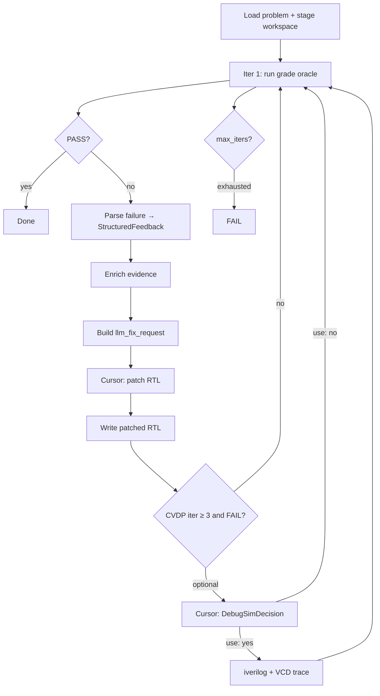

# AIfordebugging — LLM-Guided RTL Debug with EDA Tool Feedback

An automated **ReAct** (reason–act–observe) pipeline for **Verilog/SystemVerilog RTL debugging**. A fixer LLM (Cursor) patches RTL using structured evidence from simulation, waveforms, optional formal checks, and benchmark-specific harnesses. Two evaluation tracks are supported:


| Track           | Benchmark                                                | Grading oracle                             |
| --------------- | -------------------------------------------------------- | ------------------------------------------ |
| **ChipBench**   | `third_party/ChipBench/` (one-shot arithmetic debug set) | Local **iverilog** + reference model + VCD |
| **CVDP cid016** | NVIDIA CVDP v1.1.0 JSONL (non-agentic + agentic)         | Official **Docker/cocotb** harness         |


Supporting **MCP tools** (`mcp_server.py`) expose iverilog, VCD parsing, and SymbiYosys to agents; the ReAct runners call the same logic directly in Python.

---

## How to compile, run, and test

### Prerequisites

- **WSL Ubuntu 22.04** (recommended) or Linux with Docker
- System tools: `iverilog`, `vvp`, `yosys`, `symbiyosys` (see [docs/SETUP.md](docs/SETUP.md))
- **Docker** (required for CVDP harness)
- Python 3.10+

Full install (EDA tools + Python venv):

```bash
chmod +x install.sh
./install.sh
```

Or manual steps: **[docs/SETUP.md](docs/SETUP.md)**.

```bash
cd /mnt/c/Users/user/Desktop/AIfordebugging
source .venv/bin/activate   # after ./install.sh

# Verify EDA + Python deps
iverilog -V && yosys -V
python -c "import httpx, mcp, vcdvcd; print('ok')"
```

### Environment (Cursor fixer)

```bash
export CURSOR_API_KEY="cursor_..."
# Optional: bridge (WSL/desktop) vs REST (headless)
export CURSOR_TRANSPORT=auto          # default: try bridge, fall back to REST
export CURSOR_CLOUD_REPO_URL="https://github.com/YOU/AIfordebugging"  # if REST
```

### CVDP benchmark setup (one-time)

```bash
# Dataset (already under third_party/cvdp/datasets/ if downloaded)
# Docker image from NVIDIA CVDP benchmark:
cd third_party/cvdp/cvdp_benchmark
docker build -t nvidia/cvdp-sim:v1.0.0 .
# Or set OSS_SIM_IMAGE in third_party/cvdp/cvdp_benchmark/.env
```

### Run — ChipBench (single problem)

```bash
source .venv/bin/activate
export CURSOR_API_KEY="..."

PYTHONPATH=. python -m react.react_runner \
  --prob-id Prob001 \
  --prompt "third_party/ChipBench/Verilog Debugging/dataset_debug_one_shot_arithmetic/Prob001_continuous_input_sequence_detect_prompt.txt" \
  --testbench "third_party/ChipBench/Verilog Debugging/dataset_debug_one_shot_arithmetic/Prob001_continuous_input_sequence_detect_test.sv" \
  --ref "third_party/ChipBench/Verilog Debugging/dataset_debug_one_shot_arithmetic/Prob001_continuous_input_sequence_detect_ref.sv" \
  --use-cursor-sdk \
  --max-iters 3
```

**Batch (full arithmetic set):**

```bash
PYTHONPATH=. python react/batch_runner.py \
  --dataset-dir "third_party/ChipBench/Verilog Debugging/dataset_debug_one_shot_arithmetic" \
  --use-cursor-sdk \
  --max-iters 3
```

Artifacts: `outputs/<ProbID>_output/` (`llm_fix_request.md`, `wave.vcd`, `react_trace.md`, …).

### Run — CVDP cid016 (single problem)

```bash
PYTHONPATH=. python -m react_cvdp \
  --jsonl third_party/cvdp/datasets/cvdp_v1.1.0_nonagentic_code_generation_no_commercial.jsonl \
  --format nonagentic \
  --use-cursor-sdk \
  --max-iters 5 \
  --problem-ids cvdp_copilot_32_bit_Brent_Kung_PP_adder_0001 \
  --cvdp-env third_party/cvdp/cvdp_benchmark/.env
```

**Agentic subset:**

```bash
PYTHONPATH=. python -m react_cvdp \
  --jsonl third_party/cvdp/datasets/cvdp_v1.1.0_agentic_code_generation_no_commercial.jsonl \
  --format agentic \
  --use-cursor-sdk \
  --max-iters 7 \
  --problem-ids cvdp_agentic_lfsr_0001 \
  --cvdp-env third_party/cvdp/cvdp_benchmark/.env
```

See also [react_cvdp/README.md](react_cvdp/README.md).

### Run — MCP server (tool demo)

```bash
python mcp_server.py
```

Exercise `run_iverilog`, `vcd_to_text`, `trace_vcd_failure`, `run_sby` from Cursor MCP or the demos in `rtl/`, `tb/`, `bugs/uart_fifo/`.

### Test


| What                    | Command                                                                                           |
| ----------------------- | ------------------------------------------------------------------------------------------------- |
| Compose staging (unit)  | `python scripts/test_compose_volumes.py`                                                          |
| Summarize batch results | `python scripts/summarize_results.py`                                                             |
| List agentic cid016 IDs | `python scripts/list_agentic_cid016.py`                                                           |
| MCP / EDA smoke         | `iverilog -g2012 -o build/a.out -s tb_counter rtl/counter.sv tb/tb_counter.sv && vvp build/a.out` |


There is no full pytest suite for the ReAct loop; correctness is judged by benchmark harness pass/fail and saved artifacts under `outputs/`.

---

## Key research contributions (this project / this semester)

1. **Unified ReAct RTL debug loop** — Iterative *simulate → parse → enrich evidence → LLM patch → re-simulate*, with explicit structured feedback instead of raw logs alone.
2. **Multi-source evidence fusion for the fixer prompt**
  - Classified errors (`syntax`, `logic`, `compile`, …) with strategy hints
  - **VCD causal tracing** (first mismatch time + signal transitions before failure)
  - **Connection maps** (TB/DUT/ref wiring for waveform interpretation)
  - Optional **SymbiYosys** formal wrapper + counterexample VCD on repeated sim failure (ChipBench)
3. `**cursor_transport`** — Portable Cursor integration: local SDK bridge on WSL/desktop, automatic fallback to Cloud Agents REST on headless hosts.
4. **CVDP cid016 integration (`react_cvdp/`)** — Parallel pipeline that does *not* modify ChipBench code:
  - JSONL load + workspace staging from `input.context` (no golden patch on public HF)
  - Docker Compose cocotb harness as authoritative grade
  - Multi-file RTL patching for agentic problems
  - **Cursor-decided optional iverilog debug TB** (separate call from iter 3+) with local VCD trace fed into the next fix iteration
  - Docker Compose volume merging fix for agentic harness YAML
5. **Benchmark-specific grading hygiene** — e.g. `chipbench_effective_pass()` for tri-state compare artifacts; CVDP cocotb parsers separate from ChipBench iverilog parsers.

---

## Prior work — not counted as this project’s contribution

*Honor-based disclosure. Omitting items here, if later identified, may affect grading.*

### Third-party packages, tools, and frameworks


| Component                                      | Role                                                                       |
| ---------------------------------------------- | -------------------------------------------------------------------------- |
| **Icarus Verilog** (`iverilog`/`vvp`)          | Simulation                                                                 |
| **Yosys / SymbiYosys** (`sby`)                 | Formal verification                                                        |
| **vcdvcd**                                     | VCD parsing                                                                |
| **Cursor** / **cursor-sdk** / Cloud Agents API | LLM fixer                                                                  |
| **MCP** (Model Context Protocol)               | Tool server protocol                                                       |
| **Docker / Docker Compose**                    | CVDP harness execution                                                     |
| **cocotb / pytest**                            | CVDP test execution                                                        |
| **Hugging Face / PyTorch**                     | Optional VeriDebug-HF model ([docs/VERIDEBUG_HF.md](docs/VERIDEBUG_HF.md)) |
| **httpx**                                      | REST transport                                                             |


### Third-party benchmarks and datasets


| Resource                                                  | Location                                |
| --------------------------------------------------------- | --------------------------------------- |
| **ChipBench**                                             | `third_party/ChipBench/`                |
| **NVIDIA CVDP** (v1.1.0 JSONL + `cvdp_benchmark` harness) | `third_party/cvdp/`                     |
| **VeriDebug** paper/model (LLM-EDA/VeriDebug)             | Integrated optionally; not our training |


### Work present before this semester (in this repo or by others)


| Item                                          | Notes                                                                                                       |
| --------------------------------------------- | ----------------------------------------------------------------------------------------------------------- |
| `**mcp_server.py`** + counter/UART-FIFO demos | Pre-existing EDA MCP tooling and small RTL examples (`rtl/`, `tb/`, `bugs/uart_fifo/`, `formal/`)           |
| **ChipBench dataset & reference flows**       | External benchmark; we wrap it in `react/`                                                                  |
| **CVDP benchmark infrastructure**             | NVIDIA’s Docker harness, JSONL schema, cocotb tests — we orchestrate, not author                            |
| **ReAct / agent paradigm**                    | General LLM pattern; our contribution is the *RTL-specific evidence pipeline*                               |
| **veridebugger-style parsers**                | `react/parsers.py` and `react/vcd_trace.py` note inspiration from veridebugger; extended for ChipBench/CVDP |
| **Cursor IDE / Composer**                     | Commercial fixer; we call it via API, not train it                                                          |


### What *is* our implementation this semester

- `react/` — ChipBench ReAct runner, parsers, VCD trace, connection map, formal generator/runner, Cursor/VeriDebug fixers, batch runner  
- `react_cvdp/` — CVDP staging, harness runner, cocotb parsers, multi-file fixer, debug-TB path  
- `react/cursor_transport.py` — bridge/REST session handling  
- Integration glue, prompt compaction, artifact layout under `outputs/`

---

## Algorithm

### High-level ReAct loop (both tracks)




**ChipBench oracle:** `iverilog` compile + `vvp` run; compare DUT vs `ref.sv` via TB; optional formal after repeated failure.

**CVDP oracle:** `docker compose run` cocotb/pytest harness (authoritative PASS/FAIL).

### Pseudocode

```
procedure RUN_REACT(problem, max_iters, use_cursor_sdk):
    workspace ← STAGE(problem)
    buggy_rtl ← workspace.initial_rtl
    debug_evidence ← ∅

    for it in 1 .. max_iters:
        if it > 1 and not use_cursor_sdk:
            break

        if it > 1:
            prompt ← BUILD_FIX_PROMPT(
                spec, buggy_rtl, current_rtl,
                harness_or_sim_log, StructuredFeedback,
                vcd_summary, connection_map, debug_evidence)
            patch ← CURSOR(prompt)                    # bridge or REST
            WRITE_RTL(workspace, patch)

        if CVDP and it ≥ 3 and use_cursor_sdk and last_grade == FAIL:
            decision ← CURSOR_DEBUG_DECISION(...)
            if decision.use:
                tb ← decision.testbench
                sim ← IVERILOG(workspace.rtl, tb)
                debug_evidence ← VCD_CAUSAL_TRACE(sim.wave)

        grade ← RUN_ORACLE(workspace)                 # iverilog or Docker harness
        feedback ← PARSE(grade.stdout, grade.stderr)

        if grade.passed:
            return PASS

    return FAIL
```

### Algorithm description

1. **Staging** — Materialize RTL, testbench/harness, and frozen buggy snapshot. CVDP seeds from JSONL `context` (equivalent to official `--no-patch`); agentic problems copy all `rtl/` files but only `patch` targets are editable by Cursor.
2. **Grading** — Run the benchmark oracle. ChipBench counts mismatches and first mismatch time from TB hints. CVDP runs embedded cocotb tests inside the NVIDIA sim image.
3. **Structured feedback** — Normalize logs into `error_kind`, compile errors, and simulation failures (expected vs actual). Harness failure excerpts are promoted to the top of prompts.
4. **Evidence enrichment (ChipBench)** — On failure: build connection map; run `trace_vcd_failure` on `wave.vcd`; optionally generate/run SymbiYosys wrapper after the second sim failure.
5. **Evidence enrichment (CVDP, iter ≥ 3)** — Separate Cursor call returns `DebugSimDecision: use yes|no`. If yes, Cursor authors a minimal SystemVerilog TB; pipeline runs local iverilog and attaches causal VCD text to the *next* RTL-fix prompt. Docker harness remains the only pass criterion.
6. **Fixing** — Cursor returns `## PatchedFiles` (CVDP multi-file) or `## FixedTopModule` (ChipBench). Prompt size is capped for bridge vs REST limits.
7. **Termination** — Stop on oracle PASS, exhausted `max_iters`, or missing fixer (`--use-cursor-sdk` off after iter 1).

---

## Notable implementation details


| Area               | Detail                                                                                                                             |
| ------------------ | ---------------------------------------------------------------------------------------------------------------------------------- |
| **Transport**      | `CursorPromptSession` reuses one SDK bridge per batch; poisoned bridge retries once; REST uses linked GitHub repo                  |
| **CVDP compose**   | `_ensure_compose_volumes()` merges `rtl/`, `rundir/`, `verif/` into a single `volumes:` block (fixes agentic `./src:` mount style) |
| **Paths on WSL**   | Avoid `Path.resolve()` on `/mnt/c` in runners; absolute paths without symlink resolution                                           |
| **Hi-Z artifacts** | `chipbench_effective_pass()` treats functional match as PASS when ChipBench XOR compare flags hi-Z on data buses                   |
| **Formal budget**  | Repeat BMC skipped after first completed run or timeout per problem                                                                |
| **Artifacts**      | Per-iter `harness_stdout_iter_N.txt`, `llm_fix_request_iter_N.md`, `cursor_sdk_iter_N.txt`, `react_trace.md`, `result.json`        |


---

## Experimental results

Results are stored under `outputs/<problem_id>/result.json` (local runs; not committed — see `.gitignore`). Regenerate summary:

```bash
python scripts/summarize_results.py
```

### CVDP non-agentic cid016 (sample of completed runs)


| Result                            | Count (snapshot)                                                           |
| --------------------------------- | -------------------------------------------------------------------------- |
| **PASS** (`harness_passed: true`) | **34** problems                                                            |
| **FAIL** after max iters          | **4** problems (incl. duplicate Brent-Kung dir, line_buffer, partial runs) |


**Representative PASS** (2–3 iterations typical): Brent-Kung adder, AXI ALU, caesar cipher, montgomery mul, scrambler, …

**Representative FAIL** (7 iterations): `cvdp_copilot_line_buffer_0003` (multi-geometry line buffer; compile then logic failures).

**Example PASS:** `cvdp_copilot_32_bit_Brent_Kung_PP_adder_0001` — harness PASS at **iteration 2** (1 patch after initial FAIL).

### CVDP agentic cid016 (partial batch)


| Problem                                       | Result                            | Iters |
| --------------------------------------------- | --------------------------------- | ----- |
| `cvdp_agentic_AES_encryption_decryption_0003` | FAIL                              | 7     |
| `cvdp_agentic_AES_encryption_decryption_0005` | FAIL                              | 7     |
| Others                                        | Batch interrupted / not fully run | —     |


Harness **infrastructure worked** (Docker + cocotb); AES multi-round crypto did not converge within 7 Cursor patches. Agentic batch was slow (~39 min/problem for AES_0005).

### ChipBench (Prob001–Prob034 subset)

Multiple problems under `outputs/Prob*_output/` with Cursor iter artifacts (e.g. Prob001 PASS in 2 iterations per terminal logs). Full batch metrics depend on last `batch_runner.py` invocation.

### Observations

- **Non-agentic CVDP cid016:** High pass rate on tried problems with `--use-cursor-sdk` and Docker harness; most fixes in 2–4 iterations.
- **Agentic:** Harder (multi-file RTL, longer prompts); AES and similar crypto blocks remain open.
- **Debug TB path:** Helps on some logic bugs; often declined or fails compile on complex AES (iverilog limitations).
- **REST vs bridge:** Both work; REST used when bridge unavailable; adds latency from polling.

---

## Repository layout

```
AIfordebugging/
├── mcp_server.py           # MCP: iverilog, VCD, sby
├── react/                  # ChipBench ReAct pipeline
├── react_cvdp/             # CVDP cid016 ReAct pipeline
├── run_cvdp_batch.py       # CVDP CLI entry
├── third_party/
│   ├── ChipBench/          # ChipBench benchmark (external)
│   └── cvdp/               # CVDP dataset + benchmark (external)
├── docs/SETUP.md           # Toolchain install
├── docs/VERIDEBUG_HF.md    # Optional HF fixer
├── scripts/                # Helpers (summarize_results, list_agentic_cid016, …)
├── outputs/                # Run artifacts (gitignored)
├── rtl/, tb/, bugs/        # Small demos (pre-project)
└── requirements.txt
```

---

## References

- NVIDIA CVDP: [cvdp-benchmark](https://github.com/nvidia/cvdp-benchmark) / Hugging Face dataset `cvdp_v1.1.0`
- ChipBench: [https://github.com/zhongkaiyu/ChipBench](https://github.com/zhongkaiyu/ChipBench)
- VeriDebug: [arXiv:2504.19099](https://arxiv.org/abs/2504.19099) (optional `--use-veridebug-hf`)

