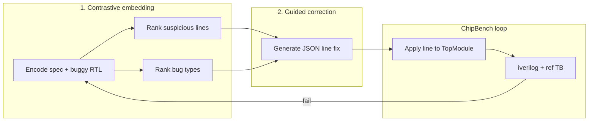

# Hugging Face VeriDebug (LLM-EDA/VeriDebug)

Integration of the research model from [arXiv:2504.19099](https://arxiv.org/abs/2504.19099) into the ChipBench ReAct loop.

This is **not** the same as [hernantech/veridebugger](https://github.com/hernantech/veridebugger) (LangGraph + Gemini). It uses the trained **GritLM** weights on Hugging Face: [LLM-EDA/VeriDebug](https://huggingface.co/LLM-EDA/VeriDebug).

## Architecture



| Phase | Paper term | Code |
|-------|------------|------|
| Representation | Contrastive embedding | `rank_buggy_lines()`, `rank_bug_types()` in `react/veridebug_hf_fixer.py` |
| Generation | Guided correction | `guided_correction()` |
| Apply | — | `apply_line_fix()` patches one line in `TopModule` |
| Verify | — | existing `run_react_loop()` simulation |

## Setup (RTX 4090 / valkyrie — recommended for VeriDebug)

24GB VRAM fits the 7B model without zeus-style hacks. You still need **iverilog** for ChipBench sim (install without sudo):

```bash
# micromamba (user-local)
curl -Ls https://micro.mamba.pm/api/micromamba/linux-64/latest | tar -xvj bin/micromamba
eval "$(~/bin/micromamba shell hook -s bash)"

micromamba create -n chipbench -c conda-forge iverilog python=3.12 -y
micromamba activate chipbench

cd ~/AIfordebugging
python -m venv .venv && source .venv/bin/activate
# Match driver CUDA 12.4+ on valkyrie (595.x) — use cu124, not cu121
pip install 'numpy<2' 'torch>=2.4.0' --index-url https://download.pytorch.org/whl/cu124
pip install -r requirements-veridebug-hf.txt -r requirements.txt
pip install -U 'bitsandbytes>=0.43.3'
bash scripts/fetch_veridebug_modeling.sh

export VERIDEBUG_HF_MODEL=LLM-EDA/VeriDebug
unset VERIDEBUG_HF_OFFLOAD_DISK VERIDEBUG_HF_LOAD_IN_8BIT VERIDEBUG_HF_DEVICE_MAP
# 4-bit auto-selected on GPUs <=24GB (CPU-staged quant during load)
# Optional fp16: export VERIDEBUG_HF_BITS=0

iverilog -V   # must pass before running ChipBench
PYTHONPATH=. python -m react.react_runner --prob-id Prob001 ... --use-veridebug-hf --max-iters 5
```

## Setup (Linux GPU server, e.g. zeus)

```bash
cd ~/AIfordebugging
python3 -m venv .venv
source .venv/bin/activate

# Match driver CUDA 12.2 (535.x) — use cu121, not cu124
pip install torch==2.2.2 --index-url https://download.pytorch.org/whl/cu121
pip install -r requirements-veridebug-hf.txt
pip install -r requirements.txt

# VeriDebug weights on HF omit the custom llama_grit modeling file
bash scripts/fetch_veridebug_modeling.sh

export VERIDEBUG_HF_MODEL=LLM-EDA/VeriDebug
export VERIDEBUG_HF_DEVICE_MAP=auto   # 11GB GPUs: partial GPU + CPU offload
```

Optional: `export HF_TOKEN=...` for faster Hugging Face downloads.

### Troubleshooting

| Symptom | Fix |
|---------|-----|
| `model type llama_grit` not recognized | Run `bash scripts/fetch_veridebug_modeling.sh`, then `pip install transformers==4.41.2` |
| CUDA driver too old for PyTorch | Reinstall torch with `cu121` wheel (see above), not `cu124` |
| NumPy 2.x + torch warning | `pip install 'numpy<2'` |
| `Cannot allocate memory` loading weights | Often `ulimit -v` (~15GB on zeus) — run `ulimit -v unlimited`; also use 8-bit |
| `undefined symbol: ncclCommResume` | PyTorch/NCCL mismatch after pip upgrades — reinstall `torch==2.2.2` cu121 |
| CUDA OOM / `CUDA driver error` while loading | Run `nvidia-smi`. On RTX 4090 reinstall **torch cu124** + `bitsandbytes>=0.43.3`. Default 4-bit uses CPU-staged load via `max_memory`. |
| CUDA OOM on 11GB GPU | Add disk offload: `VERIDEBUG_HF_OFFLOAD_DISK=1 VERIDEBUG_HF_GPU_GIB=5` |
| `ulimit -v` ~15GB, cannot raise | Use 4-bit + disk offload on zeus; avoid large CPU mmap |

## Setup (WSL + GPU)

```bash
cd /mnt/c/Users/user/Desktop/AIfordebugging
source .venv/bin/activate

# PyTorch with CUDA (adjust URL for your CUDA version)
pip install torch --index-url https://download.pytorch.org/whl/cu124
pip install -r requirements-veridebug-hf.txt

export VERIDEBUG_HF_MODEL=LLM-EDA/VeriDebug
export VERIDEBUG_HF_DEVICE_MAP=auto   # multi-GPU / large VRAM
```

First run downloads weights from Hugging Face (~several GB).

## Single problem

```bash
python react/react_runner.py \
  --prob-id Prob001 \
  --prompt "third_party/ChipBench/Verilog Debugging/dataset_debug_one_shot_arithmetic/Prob001_continuous_input_sequence_detect_prompt.txt" \
  --testbench "third_party/ChipBench/Verilog Debugging/dataset_debug_one_shot_arithmetic/Prob001_continuous_input_sequence_detect_test.sv" \
  --ref "third_party/ChipBench/Verilog Debugging/dataset_debug_one_shot_arithmetic/Prob001_continuous_input_sequence_detect_ref.sv" \
  --use-veridebug-hf \
  --max-iters 5
```

## Batch

```bash
python run_chipbench_batch.py \
  --dataset-dir "third_party/ChipBench/Verilog Debugging/dataset_debug_one_shot_arithmetic" \
  --use-veridebug-hf \
  --max-iters 5
```

Optional: `--veridebug-hf-model LLM-EDA/VeriDebug`

## Artifacts

Per iteration (when fix runs):

- `veridebug_hf_iter_N.txt` — rationale, ranked lines/types, JSON fix
- `structured_feedback_iter_N.json` — iverilog/sim parsers (same as Cursor path)

## Limitations vs Cursor SDK

| | VeriDebug HF | Cursor SDK |
|---|--------------|------------|
| Fix granularity | **One line** per iteration | Full `TopModule` rewrite |
| Hardware | GPU + large RAM | API key + IDE bridge |
| ChipBench fit | Best when bug is a **local line** error | Better for multi-line / structural bugs |
| Training | Paper fine-tuned GritLM | General agent |

If `apply_line_fix()` cannot match the model’s `buggy_code` string to a line in your RTL, the iteration leaves RTL unchanged; use `--use-cursor-sdk` or increase `--max-iters`.

## Environment variables

| Variable | Default | Purpose |
|----------|---------|---------|
| `VERIDEBUG_HF_MODEL` | `LLM-EDA/VeriDebug` | Hugging Face model id or local path |
| `VERIDEBUG_HF_BITS` | `4` on GPUs <=24GB | `4`, `8`, or `0` for fp16 |
| `VERIDEBUG_HF_DEVICE_MAP` | (unset) | e.g. `auto` for `device_map` |
| `VERIDEBUG_HF_OFFLOAD_DISK` | on <=12GB GPUs | Spill weights to disk (1080 Ti) |

## Module API

```python
from react.veridebug_hf_fixer import fix_with_veridebug_hf, run_retrieval, get_veridebug_model

model = get_veridebug_model("LLM-EDA/VeriDebug")
retrieval = run_retrieval(model, spec_text, buggy_sv)
# retrieval.ranked_lines, retrieval.top_type, ...

result = fix_with_veridebug_hf(
    prob_id="Prob001",
    spec_text=prompt_text,
    current_sv=rtl,
    sim_stdout=stdout,
    structured_feedback=feedback,
)
# result.fixed_sv, result.rationale
```
